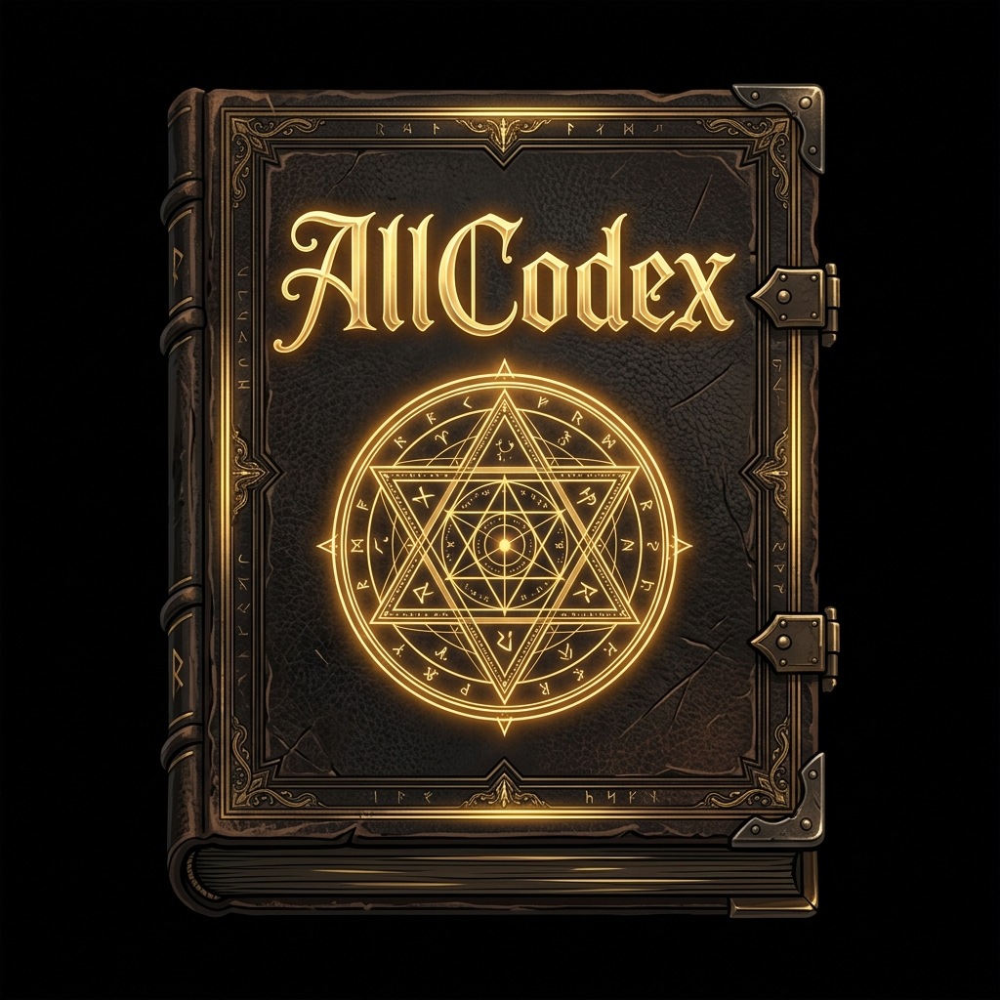

<p align="center">
  
</p>

<h1 align="center">AllCodex AIO</h1>

<p align="center">
  A self-hosted worldbuilding platform for writers, game masters, and world builders. Three services work together: a lore database, an AI orchestrator, and a web portal.
</p>

<p align="center">
  <a href="https://docs.allcodex.allmaker.dev"><strong>Explore the Live Documentation »</strong></a>
</p>

```
User → Portal (:3000) → AllKnower (:3001) → AllCodex Core (:8080)
                       → AllCodex Core (direct ETAPI for note CRUD)
```

The browser only talks to the Portal. Backend tokens never reach the client.

## Services

| Directory | Stack | Port | Role |
|---|---|---|---|
| [`allcodex-core/`](allcodex-core/) | Express 5, SQLite, pnpm | 8080 | Lore database — stores notes, attributes, relations. Serves ETAPI and public share pages. Fork of [TriliumNext/Trilium](https://github.com/TriliumNext/Trilium). |
| [`allknower/`](allknower/) | Elysia, Bun, Prisma/Postgres, LanceDB | 3001 | AI orchestrator — brain dump, RAG embeddings, consistency checks, relationship suggestions, article copilot, gap detection. |
| [`allcodex-portal/`](allcodex-portal/) | Next.js 16, React 19, Bun, shadcn/ui | 3000 | Web frontend — the only user-facing surface. Proxies all backend calls through Next.js API routes. |
| [`docs/shared/`](docs/shared/) | Markdown | — | Cross-repo documentation (git submodule, shared by all three services). |

Each service has its own README with setup instructions, features, and configuration details.

## Quick Start

### Prerequisites

- **Node.js 22.x** (Core requires it — Node 26 breaks better-sqlite3)
- **Bun** (AllKnower and Portal)
- **pnpm 10+** (Core only)
- **PostgreSQL** (AllKnower's Prisma database)

### 1. Clone with submodules

```bash
git clone --recurse-submodules https://github.com/ThunderRonin/allcodex-aio.git
cd allcodex-aio
```

### 2. Start AllCodex Core

```bash
cd allcodex-core
pnpm install
pnpm server:start          # http://localhost:8080
```

Create an ETAPI token from the server's Options page.

### 3. Start AllKnower

```bash
cd allknower
bun install
cp .env.example .env       # configure OPENROUTER_API_KEY, DB connection, etc.
bun db:generate && bun db:migrate
bun dev                    # http://localhost:3001
```

### 4. Start AllCodex Portal

```bash
cd allcodex-portal
bun install
bun dev                    # http://localhost:3000
```

Open the Portal, go to Settings, and connect to AllCodex Core (ETAPI token) and AllKnower (sign in or bearer token). Credentials are stored as HTTP-only cookies.

### All three at once (mprocs)

```bash
# From the repo root:
mprocs                     # uses mprocs.yaml to start all services
```

## Development

Commands run inside each submodule — no root-level build or test command spans all services.

| Service | Install | Dev | Test | Typecheck |
|---|---|---|---|---|
| Core | `pnpm install` | `pnpm server:start` | `pnpm test:all` | `pnpm typecheck` |
| AllKnower | `bun install` | `bun dev` | `bun test <dir>` | `bun typecheck` |
| Portal | `bun install` | `bun dev` | `bun run check` | `bun typecheck` |

### Submodule workflow

Each service is a git submodule with its own history. Commit inside the submodule first, then update the parent pointer:

```bash
cd allknower
git add . && git commit -m "feat: ..."
cd ..
git add allknower
git commit -m "chore: update allknower submodule pointer"
```

### Key cross-service files

| What | Where |
|---|---|
| Full architecture doc | [`docs/shared/reference/architecture.md`](docs/shared/reference/architecture.md) |
| ETAPI client (AllKnower → Core) | `allknower/src/etapi/client.ts` |
| Portal → Core proxy | `allcodex-portal/lib/etapi-server.ts` |
| Portal → AllKnower proxy | `allcodex-portal/lib/allknower-server.ts` |
| Lore type schemas (21 types) | `allknower/src/types/lore.ts` |
| Brain dump pipeline | `allknower/src/pipeline/brain-dump.ts` |
| HTML sanitizer | `allcodex-portal/lib/sanitize.ts` |

## Architecture

Everything in AllCodex is a **note**. Notes have types (text, code, book, image, etc.), content, and metadata via **attributes** (labels and relations). Notes live in a multi-parent tree via **branches**.

- **Becca** is the backend entity cache — all notes loaded in memory at startup. Reads from Becca, writes go to both SQLite and Becca.
- **ETAPI** (`/etapi/`) is the REST API for all note operations. Token auth. OpenAPI spec at `/etapi/openapi.json`, interactive docs at `/docs` (Scalar).
- **AllKnower** communicates with Core only via ETAPI — no shared imports across services.
- **Portal** proxies every backend call through Next.js API routes — the browser never holds ETAPI tokens or AllKnower credentials.

### Content sanitization

Core stores note content **verbatim** (including scripts, event handlers, etc.). Core only sanitizes **titles** at write time. Content sanitization is Portal's responsibility — `sanitizeLoreHtml()` and `sanitizePlayerView()` must run before rendering any note content to browsers.

For the full architecture breakdown with data flows, internals, and Mermaid diagrams, see [`docs/shared/reference/architecture.md`](docs/shared/reference/architecture.md).

## Documentation

The official user guides, API specifications, and self-hosting configurations are hosted live at **[docs.allcodex.allmaker.dev](https://docs.allcodex.allmaker.dev)**.

### Repository Reference Files

| Doc | Purpose |
|---|---|
| [`docs/shared/reference/architecture.md`](docs/shared/reference/architecture.md) | Full ecosystem architecture, data flows, service internals |
| [`docs/shared/reference/canonical-lore-schema.md`](docs/shared/reference/canonical-lore-schema.md) | 21 lore entity types — source of truth for AllKnower and Portal |
| [`docs/shared/reference/portal-api-reference.md`](docs/shared/reference/portal-api-reference.md) | Portal API route reference |
| [`docs/shared/planning/`](docs/shared/planning/) | Roadmaps and release plans |
| [`AGENTS.md`](AGENTS.md) | AI agent conventions — commands, key files, pitfalls |
| [`CLAUDE.md`](CLAUDE.md) | Claude Code cross-service guidance |

Each service also has its own `CLAUDE.md` for stack-specific conventions.

## License

See individual service repositories for license details.
